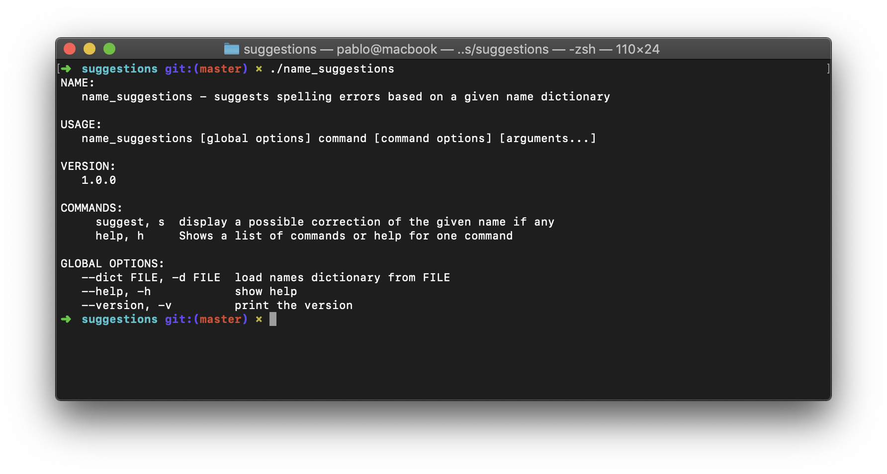

# name_suggestions
Corrector de nombres propios, utilizando el registro de nombres de la [Secretaría de Modernización](https://datos.gob.ar/)

## Instalación

Para correr el programa simplemente clonar el repositorio:

```bash
git clone git@github.com:fernandezpablo85/name_suggestions.git
```

Y luego, dentro de la carpeta `suggestions`, buildear utilizando **go 1.12 o superior** (requiere `go modules`):

```bash
cd suggestions
go build
```

## Uso

Una vez buildeado tendremos a disposición el binario `name_suggestion`:



Para generar sugerencias invocamos al comando especificando el diccionario a utilizar y el nombre a corregir:


